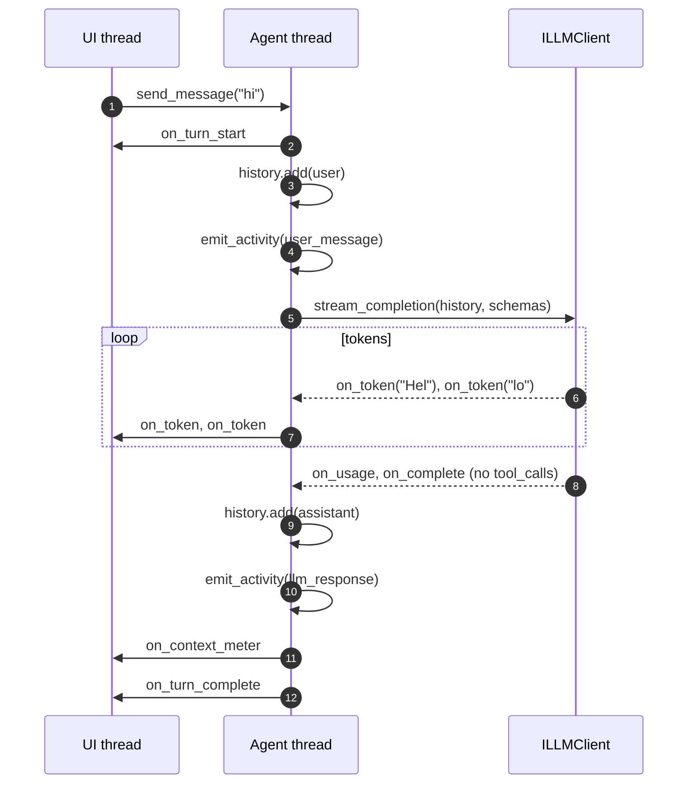
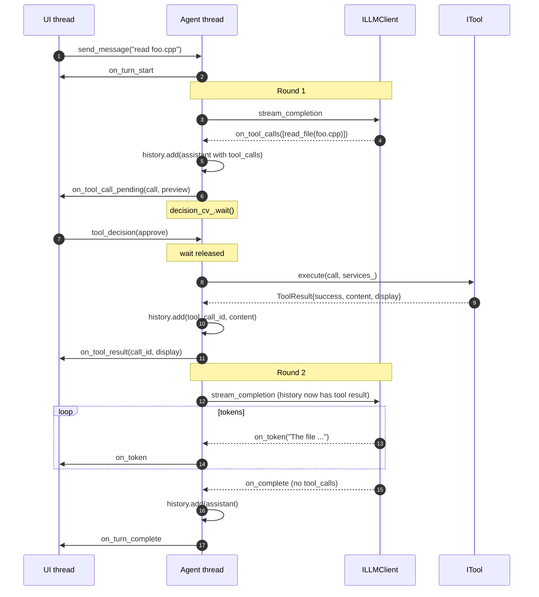
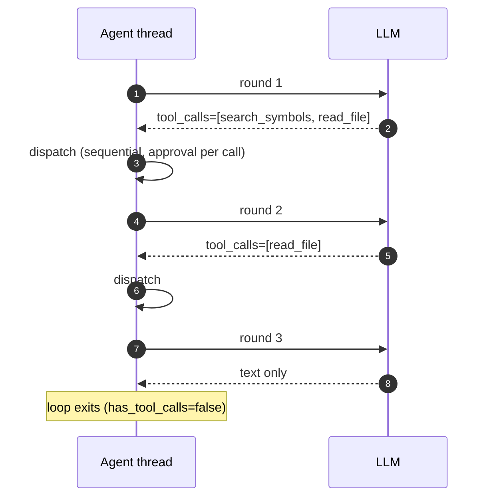

# Agent Loop

How `AgentCore` orchestrates a single user turn: threading, phases, callbacks, and the
extension points M4 features (plan mode, checkpoints, auto-verify, parallel tools) will hook
into.

This is a cross-cutting guide. For the owned data structures see
[src/agent/agent_core.h](../src/agent/agent_core.h); for tool execution mechanics see
[tool-protocol.md](tool-protocol.md); for the full system picture see
[overview.md](overview.md); for process-wide thread inventory and invariants see
[threading-model.md](threading-model.md).

---

## 1. Responsibilities

`AgentCore` is the single turn orchestrator. After S3.A it is a thin composition root -- the
heavy lifting lives in four collaborators that are owned via `unique_ptr` and wired up in the
constructor. Everything else (index, tools, LLM, frontends) is external; `AgentCore` binds them
together into a conversation.

| Concern | Owner | Header |
|---|---|---|
| Thread + message queue | `AgentCore::agent_thread_func()` + `queue_cv_` | [agent_core.h](../src/agent/agent_core.h) |
| One LLM round (schema build, streaming, usage accounting) | `AgentLoop::run_step` | [agent_loop.h](../src/agent/agent_loop.h) |
| Tool approval + execute + inject | `ToolDispatcher::dispatch` | [tool_dispatcher.h](../src/agent/tool_dispatcher.h) |
| Token accounting + overflow policy | `ContextBudget` | [context_budget.h](../src/agent/context_budget.h) |
| Activity ring buffer + frontend fan-out of events | `ActivityLog` | [activity_log.h](../src/agent/activity_log.h) |
| Slash-command parse + dispatch + autocomplete | `SlashCommandDispatcher` | [slash_commands.h](../src/agent/slash_commands.h) |
| Compaction | `AgentCore::compact_context`, delegating to `ConversationHistory` | [conversation.h](../src/agent/conversation.h) |
| Session I/O | `SessionManager` | [session_manager.h](../src/agent/session_manager.h) |
| System prompt (+ attached context) | `SystemPromptBuilder` + `AgentCore::compose_system_prompt` | [system_prompt.h](../src/agent/system_prompt.h) |
| Frontend fan-out | `FrontendRegistry` | [frontend_registry.h](../src/core/frontend_registry.h) |
| Tool-facing workspace surface | `IWorkspaceServices` (implemented by `Workspace`) | [core/workspace_services.h](../src/core/workspace_services.h) |

**Invariant:** only the agent thread writes `history_`. Collaborators never hold conversation
history directly -- `AgentLoop::run_step` returns an `AgentStepResult` that `AgentCore` appends,
and `ToolDispatcher::dispatch` receives a `ChatMessage` append callback that runs on the agent
thread. This keeps `history_` lock-free and single-writer.

---

## 2. Threading model

```
┌────────────────────┐    send_message()    ┌─────────────────────┐
│  UI / CLI thread   │─────────────────────>│  message_queue_     │
│ (also: tool_       │     push + notify    │  (mutex + cv)       │
│  decision, cancel) │                      └──────────┬──────────┘
└────────────────────┘                                 │ pop
                                                       v
                                           ┌──────────────────────┐
                                           │   Agent thread       │
                                           │   agent_thread_func  │
                                           │   (single worker)    │
                                           └──────────┬───────────┘
                                                      │
              ┌───────────────────────────────────────┼───────────────────────────────┐
              v                                       v                               v
    IFrontend callbacks                 decision_cv_.wait()              tools_.find() -> execute
    (on_token, on_tool_call_pending,    (released when UI thread or      (ran on agent thread)
     on_tool_result, ...)               cancel_turn() notifies)
    fired on agent thread
```

Key rules:

- `send_message()` is **non-blocking** from any thread. It enqueues and returns.
- `send_message_sync()` (CLI) enqueues, then blocks on `sync_cv_` until the turn finishes.
- Every `IFrontend` callback fires on the **agent thread**. wxWidgets frontend marshals to
  the UI thread via `wxQueueEvent` ([src/frontends/gui/wx_frontend.h](../src/frontends/gui/wx_frontend.h)); the CLI
  is already on the main thread (see `send_message_sync`).
- `tool_decision()` may be called from **any** thread. `AgentCore` forwards it to
  `ToolDispatcher::submit_decision`, which grabs the dispatcher-owned `decision_mutex_` and
  notifies its `decision_cv_`.
- `cancel_turn()` sets `cancel_requested_` and calls `dispatcher_->wake()` so a turn blocked on
  approval unwinds; `stop()` additionally notifies `queue_cv_` so the worker loop exits when
  the queue is empty. `cancel_requested_` is a reference shared with `ToolDispatcher` -- the
  dispatcher sees the flag without any extra signalling.

---

## 3. Turn lifecycle

A "turn" is one user message -> zero or more LLM calls with tool dispatch in between -> final
text-only assistant message. The loop caps at `WorkspaceConfig::Agent::max_rounds_per_message`
(default 100, 0 = unbounded) to prevent runaway tool chains. The cap was a hardcoded
`k_max_rounds = 20` until the agentic-Tetris run-2 build-fix loop hit it at round 20 mid-edit;
see findings.md #5 in the same output dir.

### 3.1 Entry points

```
send_message(content)           enqueue, return                  non-blocking
send_message_sync(content)      enqueue, wait for sync_cv_       blocking (CLI)
```

Both paths funnel to `agent_thread_func()` -> `process_message()`.

### 3.2 `AgentCore::process_message` phases

`process_message` is the thin orchestrator; the multi-round LLM/tool loop lives in
`AgentTurnRunner::run()` ([agent_turn.cpp](../src/agent/agent_turn.cpp)). The runner is
stack-allocated per turn, takes `(AgentCore&, turn_id, max_rounds)`, and reaches into
AgentCore's private state via the `friend class AgentTurnRunner` declaration in
[agent_core.h](../src/agent/agent_core.h).

```
process_message(content)                                         // AgentCore
 ├─ busy_ = true; cancel_requested_ = false; nudges_this_turn_ = 0
 ├─ on_turn_start broadcast                              ──> all frontends
 ├─ slash_->try_dispatch(content, ...)                    ── if handled: on_turn_complete, return
 ├─ bump turn_id; arm dispatcher checkpoints; metrics_->begin_turn
 ├─ effective_content = attached-context block + file-change diff note + user_input
 ├─ history_.add(user message); activity_->emit(user_message)
 ├─ on_context_meter broadcast
 │
 ├─ turn_had_error = AgentTurnRunner(*this, turn_id, max_rounds).run().turn_had_error
 │                                                        // see 3.2.1 below
 │
 ├─ metrics_->end_turn(turn_had_error)
 ├─ drop turn-context from dispatcher; cps->drop_turn if empty
 ├─ S4.L auto-commit (if config.git.auto_commit && agent_touched_size > 0)
 ├─ snapshot file-change tracker for next turn
 ├─ on_turn_complete broadcast
 └─ busy_ = false
```

#### 3.2.1 `AgentTurnRunner::run()` -- the round loop

```
run() -> Outcome{turn_had_error, rounds_run}                     // AgentTurnRunner
 ├─ for round = 1..max_rounds:               // 0 = unbounded; from config.agent.max_rounds_per_message
 │    ├─ if cancel_requested_: emit on_error("Turn cancelled."), break
 │    ├─ on_round_progress(round, max_rounds) broadcast
 │    ├─ apply_pending_compaction / mode_change / plan_decision / deletes
 │    ├─ drain mid-turn queued user messages (non-slash entries from message_queue_)
 │    ├─ auto-compact band check (config.compaction.auto_threshold)  ── may queue + apply pipeline
 │    ├─ if budget_->check_overflow(): break
 │    ├─ step = loop_->run_step(history_, tool_mode)              <── AgentLoop
 │    ├─ on_context_meter broadcast (with step.stream_ms)
 │    ├─ if step.had_error: turn_had_error = true; break
 │    ├─ if cancel_requested_:                                     // fork: Stop vs nudge
 │    │    if nudge_requested_ || step.watchdog_auto_nudge:
 │    │      if ++nudges_this_turn_ > 2: emit "Agent appears stuck", break
 │    │      cancel = false; history_.add(synthetic nudge user msg); continue
 │    │    else: history_.add(assistant_msg if non-empty); emit "Turn cancelled."; break
 │    ├─ history_.add(step.assistant_msg) if non-empty           <── only writer of history_
 │    ├─ if useless (empty content + no tool_calls):
 │    │    QualityMonitor::empty_response detector  -> nudge + continue, or break
 │    ├─ if step.tool_calls.empty(): break
 │    ├─ QualityMonitor::repeated_tool_call detector  -> nudge + continue
 │    ├─ for each call in step.tool_calls:
 │    │    if cancel_requested_: break
 │    │    dispatcher_->dispatch(call, append_fn)                <── ToolDispatcher
 │    │    observe_plan_tool_result(call, ...)
 │    └─ if plan_awaiting_decision_: break
 │
 └─ if max_rounds > 0 && round >= max_rounds: turn_had_error = true; emit on_error
```

`append_fn` is a lambda that calls `history_.add(msg)`; `ToolDispatcher` never touches history
directly. Round `1` is always "LLM produces text and/or requests tool calls." Subsequent rounds
only happen when the previous one emitted tool calls -- each tool result injects a `tool`
message and the loop asks the LLM to continue.

### 3.3 `AgentLoop::run_step` -- one LLM round

```
run_step(history) -> AgentStepResult
 ├─ build_tool_schemas()  ── read from IToolRegistry
 ├─ llm_.stream_completion(history, schemas, callbacks):
 │    ├─ on_token          ──> accumulated_text       + on_token broadcast
 │    ├─ on_reasoning_token──> accumulated_reasoning  + on_reasoning_token broadcast
 │    ├─ on_tool_calls     ──> tool_call_requests = calls
 │    ├─ on_complete       ──> trace log
 │    ├─ on_error          ──> on_error broadcast, activity_.emit(error), had_error=true
 │    └─ on_usage          ──> budget_.set_server_total(total_tokens)
 │
 ├─ if had_error: return { had_error=true }
 ├─ activity_.emit(llm_response) with tokens_in, tokens_delta (via ContextBudget)
 └─ return AgentStepResult {
        assistant_msg = { role=assistant, content=accumulated_text, tool_calls=... },
        tool_calls    = parsed ToolCall list,
        had_error     = false
    }
```

The loop owns neither tool execution nor history mutation -- it is a pure "build a request,
stream a response, hand back the pieces" component. Tool-call parsing (id/name/args) happens
inside the loop via `ToolRegistry::parse_tool_call`; the dispatcher receives fully parsed
`ToolCall` values.

### 3.4 `ToolDispatcher::dispatch` -- approval gate + execute + inject

```
dispatch(call, append_result)
 ├─ tool = tools_.find(call.tool_name)
 ├─ if !tool: append tool-error message + on_error + activity_.emit(error); return
 │
 ├─ activity_.emit(tool_call, summary=name, detail=args)
 ├─ policy = services_.effective_approval_policy(call.tool_name, tool->approval_policy())
 │          (IWorkspaceServices consults workspace config for per-tool overrides)
 │
 ├─ if policy == deny:
 │     append "denied by policy" tool message, return
 │
 ├─ if policy == manual:
 │     preview = tool->preview(call)
 │     on_tool_call_pending broadcast                ──> frontend shows approval UI
 │     decision_cv_.wait until pending_decision_ || cancel_flag_.load()
 │     if cancelled: append "cancelled", return
 │     if decision == reject: append "rejected", return
 │     if decision == modify && !mod_args.empty(): effective_call.args = mod_args
 │
 ├─ result = tool->execute(effective_call, services_)         <── runs on agent thread
 ├─ activity_.emit(tool_result or error)
 ├─ append_result(ChatMessage{tool, tool_call_id, result.content})
 └─ on_tool_result broadcast (display text, not raw content)
```

`auto_approve` tools skip the `on_tool_call_pending` step entirely -- the frontend never sees
an approval event, only `on_tool_result`. The dispatcher holds its own `decision_mutex_` /
`decision_cv_`; `AgentCore::tool_decision` forwards the user choice via
`submit_decision(call_id, decision, modified_args)`, and `cancel_turn()` calls `wake()` to
release `decision_cv_` so the dispatcher can observe the shared `cancel_flag_` and unwind.

Decisions are keyed by `call_id` (S5.O) -- `pending_decisions_[call_id]` plus an
`awaiting_dispatches_` set populated when a dispatch enters the approval wait. A submission
whose `call_id` isn't currently being waited on is dropped with a warn-log rather than held
indefinitely, so a stale UI click after the call already completed (or got cancelled) can
never wake a different call's dispatch later.

---

## 4. Sequence diagrams

### 4.1 Simple text-only turn



### 4.2 Turn with an approval-gated tool call



### 4.3 Cancellation while waiting for approval

```mermaid
sequenceDiagram
    autonumber
    participant UI as UI thread
    participant AG as Agent thread

    AG->>UI: on_tool_call_pending(call)
    Note over AG: decision_cv_.wait()
    UI->>AG: cancel_turn()
    Note over AG: cancel_requested_ = true;<br/>decision_cv_.notify_one()
    Note over AG: wait predicate sees<br/>cancel_requested_ and returns
    AG->>AG: inject "[cancelled]" tool message
    AG->>UI: on_tool_result(call_id, "[cancelled]")
    AG->>UI: on_error("Turn cancelled.")
    AG->>UI: on_turn_complete
```

### 4.4 Multi-round tool chain (3 rounds, 4 tools)



Each round is one `AgentLoop::run_step()` call. Round count is bounded by
`WorkspaceConfig::Agent::max_rounds_per_message` (default 500, 0 = unbounded); hitting the cap emits
`on_error("Agent reached the maximum number of tool call rounds (N). Raise
agent.max_rounds_per_message ...")` and ends the turn. The chat-footer round chip
(`set_round_progress`) updates every round so the user can see "round 7/500" while a turn is
in flight.

---

## 5. M4 extension points

The phases above are the surface area M4 features attach to. The M3 refactor (S3.A / S3.C /
S3.J) gave each of these a clean seam before they pile on. Hook points, mapped to the phase
they fire around:

| Hook | Phase | Used by | Notes |
|---|---|---|---|
| `before_turn` | start of `process_message` | plan mode (S4.D), memory bank (S4.R) | inject mode-specific system-prompt variant; recall relevant memories |
| `after_user_message` | after `history.add(user)`, before round 1 | plan mode, strong/weak router (S4.Q) | choose model / mode for this turn |
| `before_llm_step` | top of `AgentLoop::run_step` | KV-cache optimizer (S4.F), router (S4.Q) | pick model, slice history, inject system-prompt deltas |
| `after_llm_step` | after `history.add(assistant)` | telemetry (S4.S) | |
| `before_tool_dispatch` | top of `ToolDispatcher::dispatch`, after policy resolve | plan mode (blocks tools), LSP (S4.E), parallel dispatch (S4.H) | plan mode rejects any tool except `propose_plan`; LSP augments `write_file` pre-hook |
| `after_tool_success` | after `tool->execute()` returns success, before `history.add(tool)` | **checkpoint/undo (S4.B)**, ~~auto-verify (S4.C, parked)~~ | checkpoint copies prior file state before next mutation; the auto-verify hook design is preserved in the parked spec for if local LLMs grow into reliably interpreting build/test error tails |
| `after_tool_failure` | after `tool->execute()` returns failure | telemetry, retry policy | |
| `after_turn` | just before `on_turn_complete` broadcast | checkpoint GC, memory bank write-back, telemetry, **auto-commit (S4.L)** | auto-commit fires when the workspace is a git repo, `git_auto_commit` is on, and the agent touched at least one file this turn |

S3.A landed these as method seams on `AgentLoop` / `ToolDispatcher` rather than a formal
observer registry -- a subscription API is overkill while there is exactly one `AgentCore` per
workspace. An explicit observer interface can come later if a second consumer per hook appears.

### 5.1 Plan mode (S4.D)

Plan mode is a `process_message`-level state, not a new phase:

- A third agent mode enum (`chat` | `plan` | `execute`) lives on `AgentCore`.
- `plan` swaps `system_prompt_` to a variant that forbids tool calls except `propose_plan`.
- `before_tool_dispatch` rejects every other tool name with a `plan_mode_violation` tool
  message so the LLM can self-correct in the same round.
- Approving the plan flips the mode to `execute`; the plan text is pinned into
  `AttachedContext`-like slot so it survives compaction.

### 5.2 Checkpoint/undo (S4.B)

- `after_tool_success` snapshots prior file state for any mutating tool result, keyed by
  `(session_id, turn_id)`.
- A `turn_id` counter -- currently implicit in round iteration -- becomes an explicit member on
  `AgentCore` and is included in `ActivityEvent`.
- `SessionStore` (to be promoted from `SessionManager`) gains `undo_turn(session_id,
  turn_id)` which restores files and emits an activity event.

### 5.3 Auto-verify (S4.C, parked)

Parked to backlog because the "agent self-corrects from build/test error tail" premise breaks
down on small local LLMs (C++ template / linker errors in particular). The hook-point design
is preserved here for a future reactivation:

- `after_tool_success` would check `.locus/config.json` `verify.trigger` against the tool's
  mutation kind (`on_edit` vs `on_turn_end` vs `manual`).
- On non-zero exit, would inject an extra tool-like message tagged `<verify_failed>` carrying
  stdout/stderr tail. The LLM would see it in round `N+1` and react within the same turn.
- Zero exit logs only -- token discipline forbids injecting quiet successes.

See [roadmap/backlog/S4.C-auto-verify.md](../roadmap/backlog/S4.C-auto-verify.md) for the
full spec and the reactivation gate.

### 5.4 Parallel tool dispatch (S4.H)

- Today's inner loop is `for each call in step.tool_calls: dispatcher_->dispatch(call, ...)`
  in `AgentCore::process_message`.
- Parallel dispatch replaces this with a fan-out: each independent call runs on a worker,
  results are collected in the original order and fed back through the same `AppendFn` so
  `AgentCore` remains the sole writer of `history_`.
- Approval UI already supports multiple pending calls per round via `call_id` -- the
  constraint is on tool-level declarations of whether a tool is parallel-safe, not on
  `AgentCore`'s plumbing.

---

## 6. Context budget and compaction

`AgentCore::current_token_count()` delegates to `ContextBudget::current(fallback_estimate)`,
which returns the **server-reported** total when available (`server_total_`), falling back to
`history_.estimate_tokens()` when the backend (e.g. older LM Studio) omits the `usage` field.

```
ContextBudget::check_overflow(used):
  ratio = used / limit
  if ratio >= 1.0:            on_compaction_needed, return true  (caller breaks the round loop)
  if ratio >= 0.80:           on_compaction_needed, return false (turn continues)
```

Compaction itself is user-driven, never automatic:

| Strategy | Implementation | Fires |
|---|---|---|
| `drop_tool_results` (B) | `ConversationHistory::drop_tool_results()` | any time |
| `drop_oldest` (C) | `ConversationHistory::drop_oldest_turns(n)` | any time |

Strategy A ("LLM summarize") and D ("save and restart") live in [overview.md](overview.md) section
Context Management and are not yet implemented in `AgentCore`.

The seed system message at `history_.messages()[0]` is **never compacted**:
`refresh_system_prompt()` rewrites it in place when `AttachedContext` changes. Compaction
routines start from index 1.

### System-prompt size knobs (S6.11 + S6.12)

Two `WorkspaceConfig` knobs reshape the per-turn budget at the *source* rather
than via compaction. Both reset the LM Studio prefix cache when toggled (the
prompt bytes change), but the byte-stable-within-a-config invariant from S4.F
still holds.

- `lazy_tool_manifest` (S6.11): the per-turn tool catalog (both the
  prompt's "## Available Tools" section and the API `tools: [...]` array)
  degrades to one-line summaries. The model fetches full schemas on demand
  via the `describe_tool('<name>')` meta-tool. Saves ~2-3K tokens per turn
  on the default roster.
- `system_prompt_profile` (S6.12): selects which prose body the assembly
  renders -- `full` (today's verbose Rules / Editing / Shell / MSVC,
  ~700-1000 t), `compact` (load-bearing rules only, ~300 t), or `minimal`
  (just the invariants, ~80 t). Workspace metadata, LOCUS.md, memory bank,
  tools section, and format addendum are identical across profiles.

Cross-cutting rationale: [ADR-0007](decisions/0007-context-budget-reshape-lazy-manifest-and-profiles.md).

### Reasoning watchdog (S6.13)

`AgentLoop` polls combined reasoning + text channel size and elapsed wall-clock
on every stream chunk. If `WorkspaceConfig::Agent::reasoning_max_chars` /
`WorkspaceConfig::Agent::reasoning_max_seconds` (both default 0 = off; OR-semantics) trip, it broadcasts
`IFrontend::on_reasoning_watchdog_tripped(trigger, value)` and -- in auto-nudge
mode -- sets `cancel_flag_` plus `out.watchdog_auto_nudge=true` so the stream
breaks cleanly. The round loop in `AgentCore` then:

1. Distinguishes user-Stop from commit-now-nudge from auto-nudge via
   `nudge_requested_` and `step.watchdog_auto_nudge`.
2. In the nudge case clears `cancel_flag_`, appends a synthetic user message
   "Stop reasoning. Commit to a tool call now, or give a brief final answer.",
   increments `nudges_this_turn_`, and continues the loop (does NOT break).
3. Caps at 2 nudges per turn; the 3rd would-fire aborts with
   "Agent appears stuck (3 reasoning watchdog trips in one turn)."

`ILocusCore::request_commit_now()` is the programmatic entry point (used by
the chat-footer Commit-now button and by future agentic-mode harness ops);
it sets both flags atomically so the round loop sees them as a consistent pair.

### Thinking mode injection (S6.14)

Companion to the watchdog above: the watchdog *caps* a runaway reasoning
stream; this *prevents it from starting*. `WorkspaceConfig::Llm::thinking_mode`
("auto" / "on" / "off") maps to `LLMConfig::enable_thinking` at `LocusSession`
construction. When it is not `Auto`, `LMStudioClient::build_request_body` calls
the pure `apply_thinking_mode(request, messages, mode, model_id)`
([llm/thinking_injection.h](../src/llm/thinking_injection.h)), which augments
the request per the loaded model's family -- detected by
`classify_thinking_family(model_id)`:

| Family | Off | On |
|---|---|---|
| Qwen 3.x hybrid (`qwen3*`, `*-thinking-*`) | `chat_template_kwargs.enable_thinking = false` | `= true` |
| Qwen 2.x / legacy (`qwen2*`, `qwen-*`) | append `\n/no_think` to last user message | `\n/think` |
| o1 / DeepSeek-R1 (`o1-*`, `deepseek-r1-*`) | `reasoning_effort = "low"` | `"high"` |
| Unknown | no-op + one warn per process | same |

`Auto` always no-ops -- the server-default behaviour runs. The Qwen 2.x path
mutates the *last user message* per request, which breaks byte-stable
prefix-cache reuse on that message but NOT on `messages[0]` (system) -- the S4.F
byte-stable system-prompt invariant is preserved. Preserving KV cache for the
user message is out of scope: thinking-mode toggles are explicit user actions.
The read-side reasoning handling (separate DOM channel, Layer 3 compaction
stripping leaked `<think>` blocks) is unchanged. Applied at client construction,
so a change takes effect after a restart (LLM settings, like endpoint/model, are
resolved on workspace open, not hot-swapped mid-session).

---

## 7. Activity events

Every externally-visible moment in a turn emits an `ActivityEvent` to the ring buffer owned by
`ActivityLog` and broadcasts `on_activity` to all frontends. Kinds map to phases:

| Kind | Emitted from | Notes |
|---|---|---|
| `system_prompt` | `AgentCore` ctor | once at startup, records seeded tokens |
| `user_message` | `AgentCore::process_message` | after `history.add(user)` |
| `llm_response` | end of `AgentLoop::run_step` | carries `tokens_in`, `tokens_delta`, plus `[thinking]` if any reasoning was streamed |
| `tool_call` | start of `ToolDispatcher::dispatch` | before approval wait |
| `tool_result` | after successful `tool->execute` (via `ToolDispatcher`) | |
| `error` | LLM error, unknown tool, tool failure | |
| `index_event` | external subsystems via `AgentCore::emit_index_event` -> `ActivityLog::emit_index_event` | indexer, embedding worker |

Late-joining frontends (web clients, mid-session IDE attach) call
`AgentCore::get_activity(since_id=N)`, which delegates to `ActivityLog::get_since(N)`, to catch
up without replaying conversation history. Ring buffer cap: `k_activity_buffer_max = 1000`.

---

## 8. Invariants and gotchas

**Do not break these:**

1. **Single-writer history.** Only the agent thread writes `history_`. Collaborators never
   hold it directly -- `AgentLoop` returns an `AgentStepResult` that `AgentCore` appends, and
   `ToolDispatcher` receives an `AppendFn` callback. Any M4 hook that wants to append
   (checkpoint's turn marker, verify's injection) must do so via that same callback running
   on the agent thread.
2. **Approval wait is cancellable.** `ToolDispatcher::dispatch` waits on `decision_cv_` with a
   predicate that includes `cancel_flag_.load()`. `AgentCore::cancel_turn` sets the shared
   `cancel_requested_` atomic and calls `dispatcher_->wake()` to notify the condvar. Any new
   wait path must honour the same pattern, or `cancel_turn()` hangs.
3. **`sync_cv_` must always fire.** `send_message_sync` blocks on it -- every exit path from
   `process_message` (normal completion, error, round cap, cancellation) relies on the
   `sync_turn_done_ = true; sync_cv_.notify_all()` at the bottom of `agent_thread_func`.
4. **Frontend callbacks never throw across the boundary.** `FrontendRegistry::broadcast`
   isolates exceptions per frontend -- individual frontend bugs cannot take down the agent
   thread. Preserve this when adding fan-out points.
5. **`tool_decision()` is thread-agnostic.** It's called from the UI thread in all current
   frontends, but may come from a websocket thread once the Crow adapter ships in M6. `AgentCore`
   forwards it to `ToolDispatcher::submit_decision` which takes the dispatcher's own mutex --
   do not add thread-affinity assumptions on either side.
6. **Cancellation is cooperative.** `cancel_requested_` is checked between rounds and between
   tool calls within a round. S5.Z task 7 threads the same atomic into `tool->execute` as an
   optional `const std::atomic<bool>*` so long-running tools can observe a stop mid-call:
   `RunCommandTool` polls on a 50 ms slice and `TerminateJobObject`s the process tree on
   cancel; `McpTool` polls during `tools/call` and `pending_.erase(id)` + throws on cancel
   (the reader thread's late response then drops, harmlessly). Pure-CPU tools (search /
   file / plan / memory / interactive) accept the parameter and ignore it -- they finish
   in single-digit ms. `llm_.stream_completion` still completes naturally on cancel; the
   atomic is only forwarded to the tool layer.
7. **Tool-facing surface is `IWorkspaceServices`, not `Workspace`.** Tools receive
   `services_` and must not downcast to the concrete `Workspace`. This keeps tool tests
   hermetic (via `FakeWorkspaceServices`) and allows M6 to add remote/virtual workspaces.

---

## 9. Where to look next

- [src/agent/agent_core.cpp](../src/agent/agent_core.cpp) -- composition root, thread + queue, `process_message`
- [src/agent/agent_loop.cpp](../src/agent/agent_loop.cpp) -- single LLM round: schema, streaming, usage
- [src/agent/tool_dispatcher.cpp](../src/agent/tool_dispatcher.cpp) -- approval gate + execute + inject
- [src/agent/activity_log.cpp](../src/agent/activity_log.cpp) -- ring buffer + frontend fan-out
- [src/agent/context_budget.cpp](../src/agent/context_budget.cpp) -- token accounting, overflow policy
- [src/agent/slash_commands.cpp](../src/agent/slash_commands.cpp) -- parser + dispatcher + autocomplete
- [src/agent/conversation.h](../src/agent/conversation.h) -- `ConversationHistory`, `ChatMessage`, token estimation
- [src/core/workspace_services.h](../src/core/workspace_services.h) -- `IWorkspaceServices` tool-facing surface
- [src/core/frontend.h](../src/core/frontend.h) -- `IFrontend`, `ILocusCore`, `ToolDecision`, `CompactionStrategy`
- [tool-protocol.md](tool-protocol.md) -- `ITool`, approval policies, adding new tools
- [overview.md](overview.md) -- system-wide component map and context strategy
- [decisions/](decisions/) -- ADR trail for load-bearing architectural decisions
- [roadmap/M3/S3.A-agent-core-split.md](../roadmap/M3/S3.A-agent-core-split.md) -- the extraction of `AgentLoop`, `ToolDispatcher`, `ActivityLog`, `ContextBudget` (done)
- [roadmap/M4/S4.B-checkpoint-undo.md](../roadmap/M4/S4.B-checkpoint-undo.md), [S4.D-plan-mode.md](../roadmap/M4/S4.D-plan-mode.md) -- features that use the hook points above (parked: [S4.C-auto-verify.md](../roadmap/backlog/S4.C-auto-verify.md))
