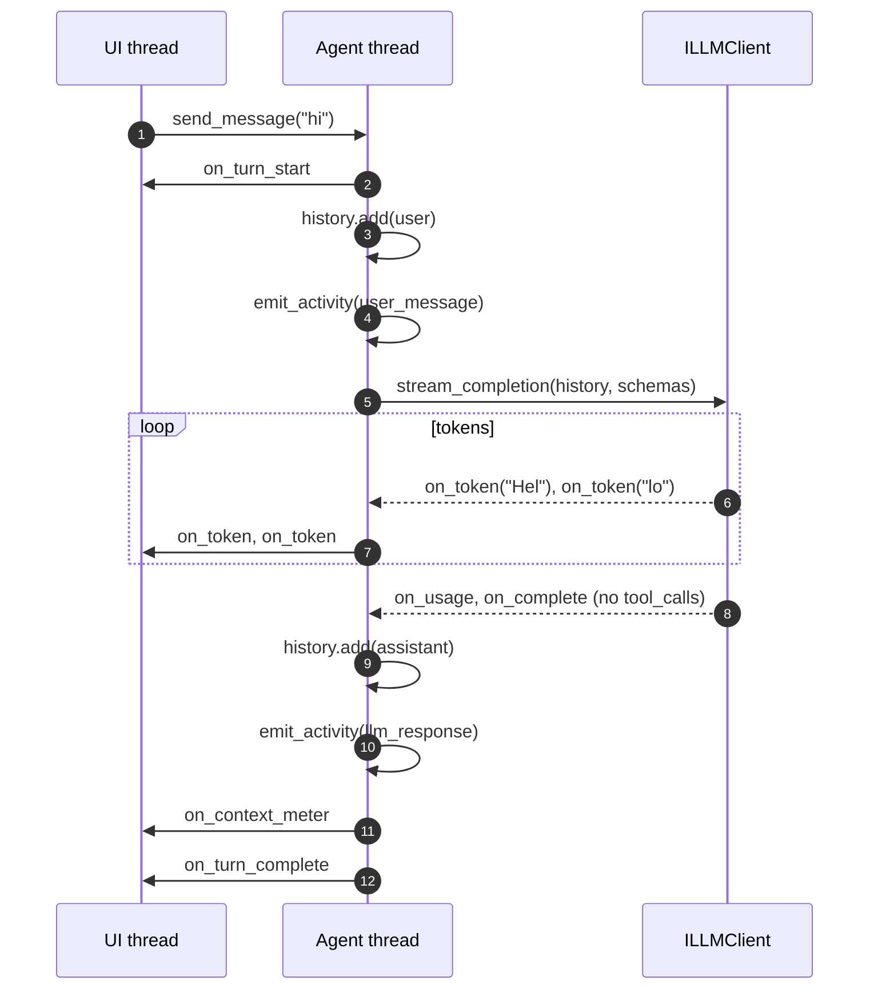
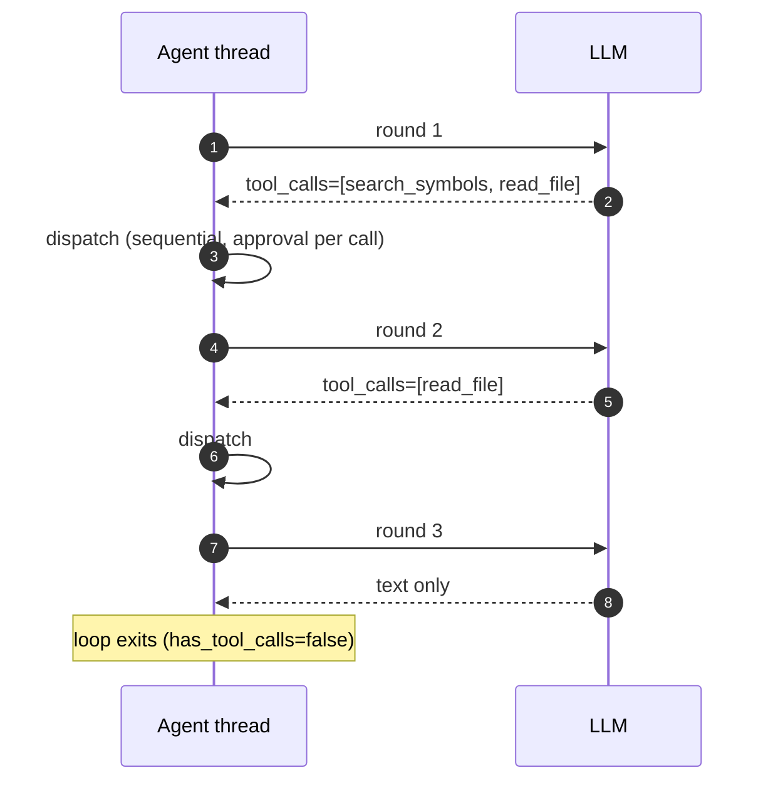

# Agent Loop

How `AgentCore` orchestrates a single user turn: threading, phases, callbacks, and the
extension points M3 refactoring exposes and M4 features (plan mode, checkpoints, auto-verify,
parallel tools) will hook into.

This is a cross-cutting guide. For the owned data structures see
[src/agent_core.h](../src/agent_core.h); for tool execution mechanics see
[tool-protocol.md](tool-protocol.md); for the full system picture see [overview.md](overview.md).

---

## 1. Responsibilities

`AgentCore` is the single turn orchestrator. Everything else (index, tools, LLM, frontends) is
external to it; `AgentCore` composes them into a conversation.

| Concern | How it's handled today | M3 target |
|---|---|---|
| Thread + message queue | `agent_thread_func()` + `queue_cv_` | stays in `AgentCore` |
| One LLM round | `run_llm_step()` | extracted to `AgentLoop` (S3.A) |
| Tool approval + execute + inject | `process_tool_call()` | extracted to `ToolDispatcher` (S3.A) |
| Token accounting + overflow | `current_token_count()`, `check_context_overflow()` | extracted to `ContextBudget` (S3.A) |
| Compaction | `compact_context()` | stays on `AgentCore`, delegates to `ConversationHistory` |
| Activity ring buffer | `emit_activity()`, `get_activity()` | extracted to `ActivityLog` (S3.A) |
| Session I/O | `SessionManager` member | promoted to `SessionStore`; checkpoint hook added (S4.B) |
| Slash commands | `try_slash_command()` | extracted to its own translation unit (S3.J) |
| System prompt (+ attached context) | `SystemPromptBuilder` + `compose_system_prompt()` | unchanged |
| Frontend fan-out | `FrontendRegistry` | unchanged |

**Invariant (preserve through M3):** only the agent thread touches `history_`. None of the
extracted collaborators hold their own lock on conversation history — they receive a
`ChatMessage` callback or read-only reference instead.

---

## 2. Threading model

```
┌────────────────────┐    send_message()    ┌─────────────────────┐
│  UI / CLI thread   │─────────────────────▶│  message_queue_     │
│ (also: tool_       │     push + notify    │  (mutex + cv)       │
│  decision, cancel) │                      └──────────┬──────────┘
└────────────────────┘                                 │ pop
                                                       ▼
                                           ┌──────────────────────┐
                                           │   Agent thread       │
                                           │   agent_thread_func  │
                                           │   (single worker)    │
                                           └──────────┬───────────┘
                                                      │
              ┌───────────────────────────────────────┼───────────────────────────────┐
              ▼                                       ▼                               ▼
    IFrontend callbacks                 decision_cv_.wait()              tools_.find() → execute
    (on_token, on_tool_call_pending,    (released when UI thread or      (ran on agent thread)
     on_tool_result, ...)               cancel_turn() notifies)
    fired on agent thread
```

Key rules:

- `send_message()` is **non-blocking** from any thread. It enqueues and returns.
- `send_message_sync()` (CLI) enqueues, then blocks on `sync_cv_` until the turn finishes.
- Every `IFrontend` callback fires on the **agent thread**. wxWidgets frontend marshals to
  the UI thread via `wxQueueEvent` ([src/gui/wx_frontend.h](../src/gui/wx_frontend.h)); the CLI
  is already on the main thread (see `send_message_sync`).
- `tool_decision()` may be called from **any** thread; it grabs `decision_mutex_` and notifies
  `decision_cv_`.
- `cancel_turn()` sets `cancel_requested_` and notifies **both** `decision_cv_` and (via
  `stop()` only) `queue_cv_`, so a turn can unwind whether it's mid-LLM-call or blocked on
  approval.

---

## 3. Turn lifecycle

A "turn" is one user message → zero or more LLM calls with tool dispatch in between → final
text-only assistant message. The loop caps at `k_max_rounds = 20` to prevent runaway tool
chains.

### 3.1 Entry points

```
send_message(content)           enqueue, return                  non-blocking
send_message_sync(content)      enqueue, wait for sync_cv_       blocking (CLI)
```

Both paths funnel to `agent_thread_func()` → `process_message()`.

### 3.2 `process_message` phases

```
process_message(content)
 ├─ busy_ = true
 ├─ on_turn_start broadcast                       ──▶ all frontends
 ├─ try_slash_command(content)         ── if true, emit output and return
 ├─ history_.add(user message)
 ├─ emit_activity(user_message)
 ├─ on_context_meter broadcast
 │
 ├─ for round = 1..k_max_rounds:
 │    ├─ if cancel_requested_: emit error, break
 │    ├─ check_context_overflow()      ── may emit on_compaction_needed, break if full
 │    ├─ has_tool_calls = run_llm_step()
 │    ├─ on_context_meter broadcast
 │    └─ if !has_tool_calls: break
 │
 ├─ if round reached cap: on_error broadcast
 ├─ on_turn_complete broadcast
 └─ busy_ = false
```

Round `1` is always "LLM produces text and/or requests tool calls." Subsequent rounds only
happen when the previous one emitted tool calls — each tool result injects a `tool` message
and the loop asks the LLM to continue.

### 3.3 `run_llm_step` — one LLM round

```
run_llm_step()
 ├─ build_tool_schemas()  ── read from IToolRegistry
 ├─ llm_.stream_completion(history, schemas, callbacks):
 │    ├─ on_token          ──▶ accumulated_text       + on_token broadcast
 │    ├─ on_reasoning_token──▶ accumulated_reasoning  + on_reasoning_token broadcast
 │    ├─ on_tool_calls     ──▶ tool_call_requests = calls
 │    ├─ on_complete       ──▶ trace log
 │    ├─ on_error          ──▶ on_error broadcast, emit_activity(error)
 │    └─ on_usage          ──▶ last_server_total_tokens_, reasoning_tokens_reported
 │
 ├─ if had_error: return false
 ├─ emit_activity(llm_response) with tokens_in, tokens_delta
 ├─ history_.add(assistant message with .tool_calls = tool_call_requests)
 │
 ├─ if !has_tool_calls: return false
 │
 └─ for each ToolCallRequest:
      ├─ if cancel_requested_: break
      ├─ ToolRegistry::parse_tool_call(...)   ── id, name, args
      ├─ tool = tools_.find(name)
      ├─ if !tool: inject "unknown tool" tool message, continue
      └─ process_tool_call(call, tool)
   return true
```

Tool calls within a single round are processed **sequentially** today. Parallel dispatch
is S4.H (out of scope for M3).

### 3.4 `process_tool_call` — approval gate + execute + inject

```
process_tool_call(call, tool)
 ├─ emit_activity(tool_call, summary=name, detail=args)
 ├─ policy = tool->approval_policy()
 │          overridden by ws_context_.workspace->config().tool_approval_policies[name]
 │
 ├─ if policy == deny:
 │     inject "denied by policy" tool message, return
 │
 ├─ if policy == manual:
 │     preview = tool->preview(call)
 │     on_tool_call_pending broadcast                ──▶ frontend shows approval UI
 │     decision_cv_.wait until pending_decision_ || cancel_requested_
 │     if cancelled: inject "cancelled", return
 │     if decision == reject: inject "rejected", return
 │     if decision == modify && !mod_args.empty(): effective_call.args = mod_args
 │
 ├─ result = tool->execute(effective_call, ws_context_)          ◀── runs on agent thread
 ├─ emit_activity(tool_result or error)
 ├─ history_.add(tool message, tool_call_id, result.content)
 └─ on_tool_result broadcast (display text, not raw content)
```

`auto_approve` tools skip the `on_tool_call_pending` step entirely — the frontend never sees
an approval event, only `on_tool_result`.

---

## 4. Sequence diagrams

### 4.1 Simple text-only turn



### 4.2 Turn with an approval-gated tool call


### 4.3 Cancellation while waiting for approval

```mermaid
sequenceDiagram
    autonumber
    participant UI as UI thread
    participant AG as Agent thread

    AG->>UI: on_tool_call_pending(call)
    Note over AG: decision_cv_.wait()
    UI->>AG: cancel_turn()
    Note over AG: cancel_requested_ = true;<br/>decision_cv_.notify_one()
    Note over AG: wait predicate sees<br/>cancel_requested_ and returns
    AG->>AG: inject "[cancelled]" tool message
    AG->>UI: on_tool_result(call_id, "[cancelled]")
    AG->>UI: on_error("Turn cancelled.")
    AG->>UI: on_turn_complete
```

### 4.4 Multi-round tool chain (3 rounds, 4 tools)



Each round is one `run_llm_step()` call. Round count is bounded by `k_max_rounds = 20`; hitting
the cap emits `on_error("Agent reached the maximum number of tool call rounds.")` and ends the
turn.

---

## 5. M3/M4 extension points

The phases above are the surface area M4 features attach to. The M3 refactor exists mainly to
give each of these a clean seam before they pile on. Hook points, mapped to the phase they fire
around:

| Hook | Phase | Used by | Notes |
|---|---|---|---|
| `before_turn` | start of `process_message` | plan mode (S4.D), memory bank (S4.R) | inject mode-specific system-prompt variant; recall relevant memories |
| `after_user_message` | after `history.add(user)`, before round 1 | plan mode, multi-model router (S4.Q) | choose model / mode for this turn |
| `before_llm_step` | top of `run_llm_step` | KV-cache optimizer (S4.F), router (S4.Q) | pick model, slice history, inject system-prompt deltas |
| `after_llm_step` | after `history.add(assistant)` | streaming tool results (S4.O), telemetry (S4.S) | |
| `before_tool_dispatch` | top of `process_tool_call`, after policy resolve | plan mode (blocks tools), LSP (S4.E), parallel dispatch (S4.H) | plan mode rejects any tool except `propose_plan`; LSP augments `write_file` pre-hook |
| `after_tool_success` | after `tool->execute()` returns success, before `history.add(tool)` | **checkpoint/undo (S4.B)**, **auto-verify (S4.C)** | checkpoint copies prior file state before next mutation; verify runs `verify.cmd` and injects `<verify_failed>` on non-zero exit |
| `after_tool_failure` | after `tool->execute()` returns failure | telemetry, retry policy | |
| `after_turn` | just before `on_turn_complete` broadcast | checkpoint GC, memory bank write-back, telemetry | |

The M3 plan (S3.A) exposes these as method seams on `AgentLoop` / `ToolDispatcher` rather than
a formal observer registry — a subscription API is overkill while there is exactly one
`AgentCore` per workspace. An explicit observer interface can come later if a second consumer
per hook appears.

### 5.1 Plan mode (S4.D)

Plan mode is a `process_message`-level state, not a new phase:

- A third agent mode enum (`chat` | `plan` | `execute`) lives on `AgentCore`.
- `plan` swaps `system_prompt_` to a variant that forbids tool calls except `propose_plan`.
- `before_tool_dispatch` rejects every other tool name with a `plan_mode_violation` tool
  message so the LLM can self-correct in the same round.
- Approving the plan flips the mode to `execute`; the plan text is pinned into
  `AttachedContext`-like slot so it survives compaction.

### 5.2 Checkpoint/undo (S4.B)

- `after_tool_success` snapshots prior file state for any mutating tool result, keyed by
  `(session_id, turn_id)`.
- A `turn_id` counter — currently implicit in round iteration — becomes an explicit member on
  `AgentCore` and is included in `ActivityEvent`.
- `SessionStore` (promoted from `SessionManager` in S3.A) gains `undo_turn(session_id,
  turn_id)` which restores files and emits an activity event.

### 5.3 Auto-verify (S4.C)

- `after_tool_success` checks `.locus/config.json` `verify.trigger` against the tool's mutation
  kind (`on_edit` vs `on_turn_end` vs `manual`).
- On non-zero exit, injects an extra tool-like message tagged `<verify_failed>` carrying
  stdout/stderr tail. The LLM sees it in round `N+1` and can react within the same turn.
- Zero exit logs only — token discipline forbids injecting quiet successes.

### 5.4 Parallel tool dispatch (S4.H)

- Current loop in `run_llm_step` is `for each ToolCallRequest: process_tool_call(...)`.
- Parallel dispatch replaces this with a fan-out: each independent call runs on a worker,
  results are collected in the original order before `history_.add(tool, ...)` calls.
- Approval UI already supports multiple pending calls per round via `call_id` — the
  constraint is on tool-level declarations of whether a tool is parallel-safe, not on
  `AgentCore`'s plumbing.

---

## 6. Context budget and compaction

`current_token_count()` returns the **server-reported** total when available
(`last_server_total_tokens_`), falling back to `history_.estimate_tokens()` when the backend
(e.g. older LM Studio) omits the `usage` field.

```
check_context_overflow():
  ratio = used / limit
  if ratio >= 1.0:            on_compaction_needed, return true  (caller breaks the round loop)
  if ratio >= 0.80:           on_compaction_needed, return false (turn continues)
```

Compaction itself is user-driven, never automatic:

| Strategy | Implementation | Fires |
|---|---|---|
| `drop_tool_results` (B) | `ConversationHistory::drop_tool_results()` | any time |
| `drop_oldest` (C) | `ConversationHistory::drop_oldest_turns(n)` | any time |

Strategy A ("LLM summarize") and D ("save and restart") live in [overview.md](overview.md) §
Context Management and are not yet implemented in `AgentCore`.

The seed system message at `history_.messages()[0]` is **never compacted**:
`refresh_system_prompt()` rewrites it in place when `AttachedContext` changes. Compaction
routines start from index 1.

---

## 7. Activity events

Every externally-visible moment in a turn emits an `ActivityEvent` to the ring buffer and
broadcasts `on_activity` to all frontends. Kinds map to phases:

| Kind | Emitted from | Notes |
|---|---|---|
| `system_prompt` | `AgentCore` ctor | once at startup, records seeded tokens |
| `user_message` | `process_message` | after `history.add(user)` |
| `llm_response` | end of `run_llm_step` | carries `tokens_in`, `tokens_delta`, plus `[thinking]` if any reasoning was streamed |
| `tool_call` | start of `process_tool_call` | before approval wait |
| `tool_result` | after successful `tool->execute` | |
| `error` | LLM error, unknown tool, tool failure | |
| `index_event` | external subsystems via `emit_index_event` | indexer, embedding worker |

Late-joining frontends (web clients, mid-session IDE attach) call
`get_activity(since_id=N)` to catch up without replaying conversation history.
Ring buffer cap: `k_activity_buffer_max = 1000`.

---

## 8. Invariants and gotchas

**Do not break these in M3 or later:**

1. **Single-writer history.** Only the agent thread writes `history_`. Any M4 hook that wants
   to append (checkpoint's turn marker, verify's injection) must do so via a callback that
   runs on the agent thread, not by grabbing a lock.
2. **Approval wait is cancellable.** Any code path that waits on `decision_cv_` must include
   `cancel_requested_.load()` in its predicate (see `process_tool_call`). Otherwise
   `cancel_turn()` hangs.
3. **`sync_cv_` must always fire.** `send_message_sync` blocks on it — every exit path from
   `process_message` (normal completion, error, round cap, cancellation) relies on the
   `sync_turn_done_ = true; sync_cv_.notify_all()` at the bottom of `agent_thread_func`.
4. **Frontend callbacks never throw across the boundary.** `FrontendRegistry::broadcast`
   isolates exceptions per frontend — individual frontend bugs cannot take down the agent
   thread. Preserve this when adding fan-out points.
5. **`tool_decision()` is thread-agnostic.** It's called from the UI thread in all current
   frontends, but may come from a websocket thread once `CrowServer` ships (M5). Do not add
   thread-affinity assumptions.
6. **Cancellation is cooperative.** `cancel_requested_` is checked between rounds and between
   tool calls within a round; it does **not** interrupt an in-flight `llm_.stream_completion`
   or `tool->execute`. Those must complete before the cancel propagates.

---

## 9. Where to look next

- [src/agent_core.cpp](../src/agent_core.cpp) — the whole 950-line source of truth today
- [src/conversation.h](../src/conversation.h) — `ConversationHistory`, `ChatMessage`, token estimation
- [src/frontend.h](../src/frontend.h) — `IFrontend`, `ILocusCore`, `ToolDecision`, `CompactionStrategy`
- [tool-protocol.md](tool-protocol.md) — `ITool`, approval policies, adding new tools
- [overview.md](overview.md) — system-wide component map and context strategy
- [roadmap/M3/S3.A-agent-core-split.md](../roadmap/M3/S3.A-agent-core-split.md) — planned extraction of `AgentLoop`, `ToolDispatcher`, `ActivityLog`, `ContextBudget`
- [roadmap/M4/S4.B-checkpoint-undo.md](../roadmap/M4/S4.B-checkpoint-undo.md), [S4.C-auto-verify.md](../roadmap/M4/S4.C-auto-verify.md), [S4.D-plan-mode.md](../roadmap/M4/S4.D-plan-mode.md) — features that will use the hook points above
