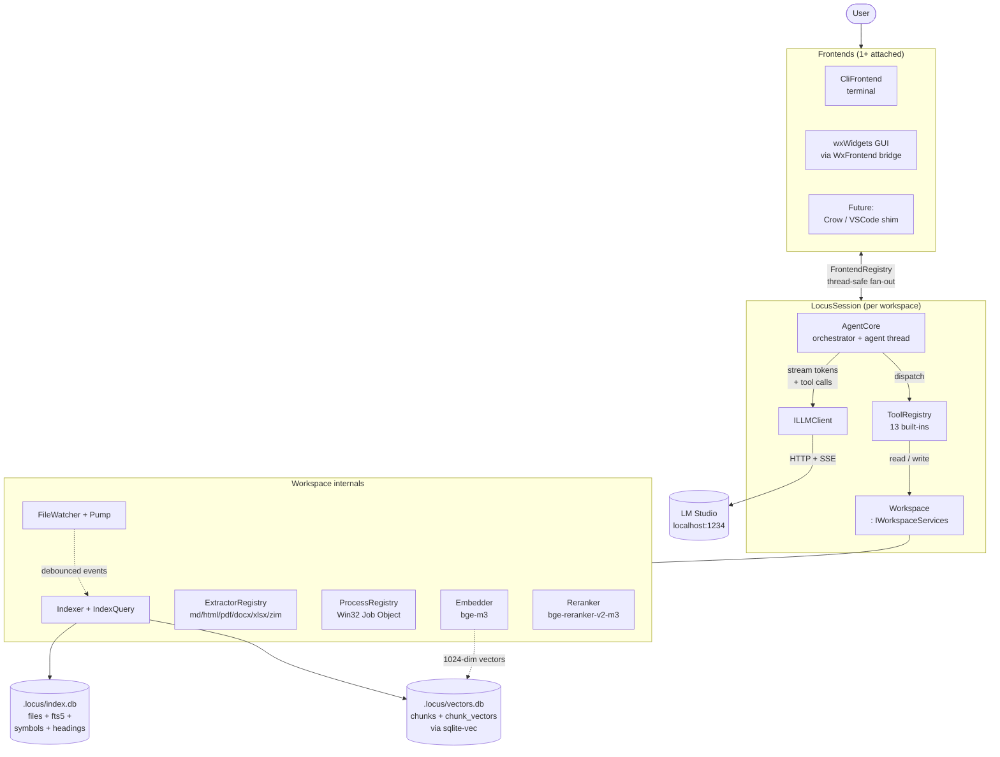
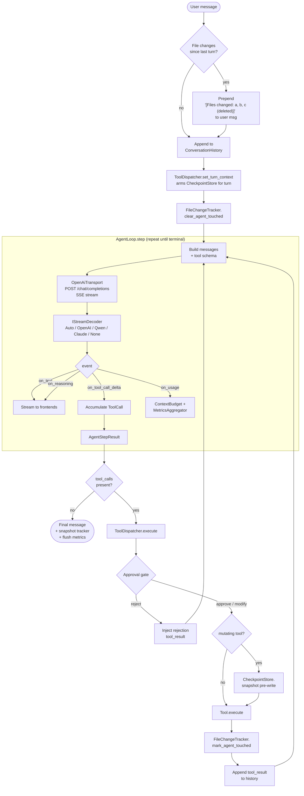
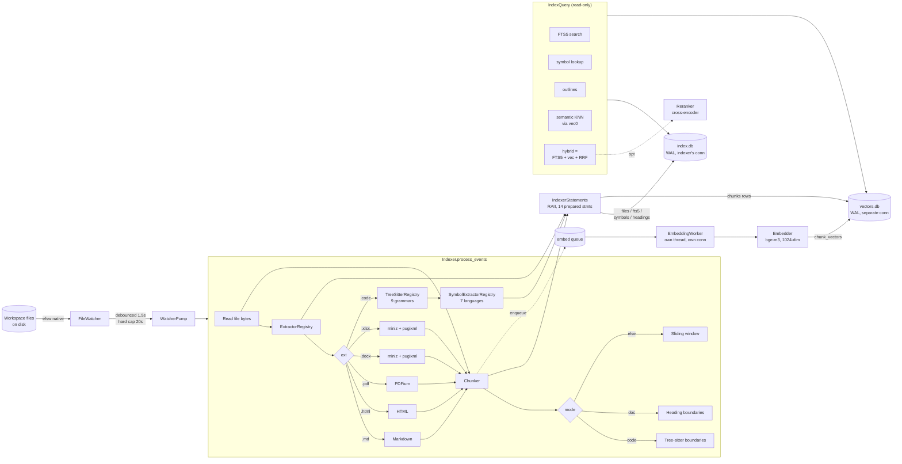
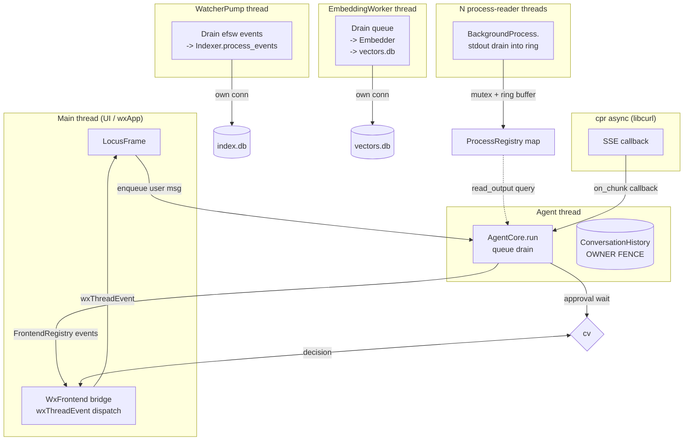
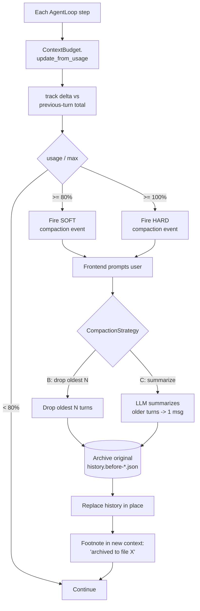

# Locus -- Architecture Diagrams

Per-subsystem visual map of what runs under the hood. All diagrams are
Mermaid -- GitHub renders them natively, no images checked in.

For prose-level depth see the sibling docs in this folder
([overview](overview.md), [agent-loop](agent-loop.md),
[threading-model](threading-model.md), [tool-protocol](tool-protocol.md),
[workspace-index](workspace-index.md)). This file is the visual index, not
the source of truth.

---

## 1. System Overview

Top-level boxes -- one `LocusSession` per opened folder, any number of
attached frontends, a single LLM endpoint per session.



---

## 2. Agent Loop -- One User Turn

End-to-end flow from "user hits Send" to "final assistant message". Tool
calls re-enter the LLM step until the model emits a terminal response.



---

## 3. Tool Approval & Checkpointing

The gate every tool passes through. User has three choices; mutating tools
also snapshot for `/undo`.

```mermaid
sequenceDiagram
    autonumber
    participant Loop as AgentLoop
    participant Disp as ToolDispatcher
    participant Front as Frontend(s)
    participant User
    participant Ckpt as CheckpointStore
    participant Tool as ITool
    participant Hist as ConversationHistory
    participant Met as MetricsAggregator

    Loop->>Disp: dispatch(ToolCall)
    Disp->>Front: emit tool_approval_request
    Front->>User: render diff / args / Modify pane
    User-->>Front: approve | modify | reject
    Front-->>Disp: ToolDecision

    alt rejected
        Disp->>Hist: append rejection tool_result
    else approved or modified
        opt mutating: edit_file / write_file / delete_file
            Disp->>Ckpt: snapshot(rel_path)
            Note over Ckpt: .locus/checkpoints/<br/>session_id/turn_id/files/...
        end
        Disp->>Tool: execute(args, IWorkspaceServices&)
        Tool-->>Disp: ToolResult
        Disp->>Met: record(name, ok, ms, content_size)
        Disp->>Hist: append tool_result
    end
```

---

## 4. Workspace Index Pipeline

How a file on disk turns into FTS rows, symbol rows, and embedding vectors.
Two SQLite DBs, two connections, two writers -- no lock contention.



---

## 5. LLM Client Stack (S3.B + S4.N)

Transport, decoders, and the per-`ToolFormat` dispatch added in S4.N. The
OpenAI native path passes through unchanged regardless of which dialect is
selected -- XML extraction is purely additive.

```mermaid
flowchart TB
    Caller[AgentLoop.complete_streaming]
    Caller --> Cli[LMStudioClient<br/>: ILLMClient]

    Cli --> Tx[OpenAiTransport<br/>cpr POST + SSE +<br/>1-shot stall retry]
    Tx -->|raw SSE 'data:'<br/>payloads| Pick

    Pick{LLMConfig.<br/>tool_format}
    Pick -->|Auto| Auto[AutoToolFormatDecoder<br/>watches Qwen + Claude markers]
    Pick -->|OpenAi| OAI[OpenAiDecoder<br/>native JSON tool_calls]
    Pick -->|Qwen| QW[QwenXmlDecoder]
    Pick -->|Claude| CL[ClaudeXmlDecoder]
    Pick -->|None| NN[OpenAiDecoder<br/>tools[] omitted]

    QW -.uses.-> Xml[XmlToolCallExtractor<br/>boundary-safe<br/>partial-marker hold-back]
    CL -.uses.-> Xml
    Auto -.uses.-> Xml

    Auto --> Sink
    OAI --> Sink
    QW --> Sink
    CL --> Sink
    NN --> Sink

    subgraph Sink["StreamDecoderSink (typed events)"]
        direction LR
        T[on_text]
        R[on_reasoning]
        D[on_tool_call_delta]
        U[on_usage]
    end

    Sink --> Caller

    Caller -.token estimate.-> TC[TokenCounter<br/>~4 chars / token<br/>+4 framing per msg]

    LR[LlmRouter<br/>weak / strong<br/>S4.Q skeleton] -.future.-> Cli
```

---

## 6. Threading Model

Every long-running thread, what it owns, and how messages cross between
them. ConversationHistory has a single owner thread (the agent thread)
enforced by `assert_owner_thread`.



---

## 7. Context Budget & Compaction

Token accounting fires on every LLM step; soft threshold (80%) and hard
threshold (100%) both raise `on_compaction_needed`. User picks strategy;
original history is archived before replacement.



---

## 8. File-Edit Safety (S4.A + S4.B)

The hallucinated-edit mitigation: read-precondition, uniqueness check,
atomic apply, snapshot. `edit_file` accepts an `edits[]` array and applies
all-or-nothing.

```mermaid
flowchart TB
    Call[edit_file call] --> RT{ReadTracker:<br/>path read this session?}
    RT -->|no| R1[Refuse:<br/>'read_file first']
    RT -->|yes| Loc[Locate each old_string<br/>in current bytes]

    Loc --> Uni{All edits unique<br/>(unless replace_all)?}
    Uni -->|no| R2[Refuse:<br/>not unique]
    Uni -->|yes| Apply[Apply edits<br/>sequentially in memory]

    Apply --> Snap[CheckpointStore.snapshot<br/>writes original byte-for-byte<br/>to checkpoints/<sid>/<tid>/files/]
    Snap --> Tmp[Write new bytes to<br/>path.tmp.<rand>]
    Tmp --> Ren[Atomic rename<br/>tmp -> path]

    Ren --> MAT[FileChangeTracker.<br/>mark_agent_touched]
    MAT --> Sum[Return unified diff<br/>summary]

    R1 --> Err[(ToolResult error<br/>visible to model)]
    R2 --> Err

    subgraph Undo["/undo turn_id (later)"]
        direction LR
        US[Read manifest] --> URe[Restore each file<br/>from snapshot]
        URe --> URem[Remove created files]
        URem --> URep[Report skipped<br/>files (>1 MB)]
    end
```

---

## How to update these

When a subsystem reshape lands:

1. Update the corresponding diagram here so it stays a faithful map.
2. Keep wording short -- diagrams compete with the prose docs for
   "fastest way to orient", not for prose-level depth.
3. Don't add more than one diagram per subsystem -- this index is meant
   to be scannable in 60 seconds.
